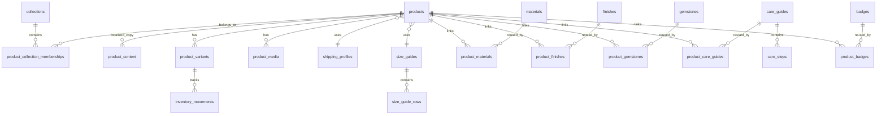

# 珠宝后台数据库设计

这套结构不是为了“存更多字段”，而是为了让后台维护更顺手：

- 新增产品时，不需要把材质、镀层、宝石、保养、尺寸都写成一坨文字。
- 调整保养说明时，不需要逐个商品改描述，只改 `care_guides` 和 `care_steps`。
- 做中英双语时，不需要把英文和中文混在同一字段里。
- 给 Shopify 主题同步时，不需要前台自己拼数据，直接读扁平视图即可。

核心文件：

- [jewelry_catalog_schema.sql](/Users/hannongshao/Documents/New%20project/database/jewelry_catalog_schema.sql)
- [jewelry_backend_seed.sql](/Users/hannongshao/Documents/New%20project/database/jewelry_backend_seed.sql)
- [jewelry_database_management_manual.md](/Users/hannongshao/Documents/New%20project/database/jewelry_database_management_manual.md)

## 设计原则

1. `products` 只放商品主档和后台状态，不堆砌长文案。
2. `product_content` 专门放中英文内容，方便双语维护。
3. 材质、镀层、宝石、保养、尺寸都是独立主数据，可复用。
4. 通过关联表把一个商品接到多个材质/保养/系列，而不是写死在产品表。
5. 用视图把关系型数据摊平成 Shopify 当前主题需要的字段。
6. 后台不仅管商品，也要管客户关系、礼物咨询、售后保养和珠宝护照。

## 结构总览

## 后台维护怎么用

### 0. 现在这套库已经不只是 catalog

这一版已经从“商品目录数据库”升级成了“珠宝后台运营数据库”，新增了 4 个运营域：

- `customers / customer_addresses / customer_profiles`：客户主档、地址和风格偏好
- `consultations / consultation_recommendations`：礼物顾问、风格咨询和推荐结果
- `jewelry_passports / passport_events`：珠宝护照、拥有记录和服务历史
- `service_requests / service_request_updates`：清洁、翻新、改圈、补镀层等售后工单

### 1. 调整保养数据

优先改这些表：

- `care_guides`
- `care_steps`
- `product_care_guides`

适合场景：

- “镀金耳环统一加一句不要喷香水后佩戴”
- “珍珠系列增加一条单独收纳说明”
- “所有敏感材质统一调整保养文案”

如果只是某个单品需要例外说明，再改：

- `product_content.care_summary_override`

### 2. 调整材质与镀层

优先改这些表：

- `materials`
- `finishes`
- `product_materials`
- `product_finishes`

适合场景：

- 新增 `18k gold vermeil`
- 把“925 silver base + 18k plating”从文本改成结构化关系
- 后续做材质筛选、材质说明页、统一保养规则

### 3. 调整尺寸数据

优先改这些表：

- `size_guides`
- `size_guide_rows`

适合场景：

- 戒围表更新
- 项链长度、耳饰尺寸说明补齐
- 不同品类共用不同尺码模板

### 4. 调整发货与退换说明

优先改这些表：

- `shipping_profiles`
- `products.shipping_profile_id`

适合场景：

- 澳洲现货和预售商品使用不同发货规则
- 调整免邮门槛
- 修改统一配送说明

### 5. 调整商品前台文案

优先改这些表：

- `product_content`

适合场景：

- 改英文标题
- 改中文短卖点
- 改 SEO 标题和描述
- 给单个产品加特殊 shipping/care override

### 6. 管理高客单客户和送礼咨询

优先改这些表：

- `customers`
- `customer_addresses`
- `customer_profiles`
- `consultations`
- `consultation_recommendations`

适合场景：

- 记录澳洲本地高价值客户
- 保存客户偏好的金属、宝石、敏感肌、戒围
- 管理“生日送礼 / 纪念日 / 自我奖励”咨询单
- 给某个咨询单推荐 3 个具体商品

### 7. 管理售后保养与珠宝护照

优先改这些表：

- `jewelry_passports`
- `passport_events`
- `service_requests`
- `service_request_updates`

适合场景：

- 为每件已售主推款登记护照编号
- 记录是谁买的、谁在佩戴、什么时候买的
- 管理清洁、翻新、改圈、补镀层等服务工单
- 追踪某件珠宝的完整售后历史

## 这套设计为什么更适合珠宝

珠宝商品和普通快消不同，后台最容易乱的不是库存本身，而是这些高频信息：

- 一个商品经常有多个材质层次：底材、镀层、宝石、珍珠、点缀材质
- 保养说明经常按材质/镀层复用
- 戒围、链长、耳饰尺寸说明结构不同
- 中英文内容和后台逻辑字段不能混在一起

所以这套模型把“商品”和“商品解释信息”拆开，后台会清楚很多。

同时，珠宝又和普通服饰不同，它天然适合做“长期关系型后台”：

- 送礼客户经常会复购，需要保存风格和预算偏好
- 高客单客户更在意售后、翻新和保养提醒
- 有些作品值得做珠宝护照和拥有记录，提升品牌价值感
- 顾问式推荐和售后服务，会直接影响复购与客单价

## 和当前 Shopify 主题怎么接

当前主题已经在使用这些字段：

- `product.metafields.custom.short_blurb`
- `product.metafields.custom.material_primary`
- `product.metafields.custom.plating_info`
- `product.metafields.custom.gemstone_type`
- `product.metafields.custom.skin_friendly_note`
- `product.metafields.custom.shipping_note`
- `product.metafields.custom.care_summary`
- `product.metafields.custom.gift_ready`
- `product.metafields.custom.size_chart`

SQL 里已经准备好了这个同步视图：

- `vw_shopify_product_custom_data`

也就是说，后台把数据维护好以后，可以由同步脚本把这张视图的结果直接推送到 Shopify metafields。

但后台本身不该只等于 Shopify。更合理的分工是：

- Shopify 继续承担前台交易、支付、订单和主题渲染
- 自建 PostgreSQL 后台承担商品主数据、客户偏好、咨询、护照和售后服务
- 两者通过同步脚本或 API 做数据桥接

## 建议的后台工作流

1. 在自建后台维护主数据：产品、材质、镀层、宝石、保养、尺寸、配送。
2. 同时维护客户档案、礼物顾问咨询、珠宝护照和售后工单。
3. 后台写入 PostgreSQL 主表。
4. 用 `vw_admin_product_overview` 给运营看商品总览。
5. 用 `vw_admin_product_care_matrix` 检查保养数据是否漏配。
6. 用 `vw_admin_customer_overview` 看客户 360 视图。
7. 用 `vw_admin_concierge_queue` 管顾问咨询和推荐。
8. 用 `vw_admin_passport_registry` 管珠宝护照和拥有记录。
9. 用 `vw_admin_aftercare_queue` 管售后保养和服务进度。
10. 用 `vw_shopify_product_custom_data` 同步商品字段到 Shopify。

## 新增后台视图

- `vw_admin_customer_overview`
  适合看客户阶段、偏好、护照数量、活跃咨询和售后状态
- `vw_admin_concierge_queue`
  适合给礼物顾问或销售跟进咨询请求
- `vw_admin_passport_registry`
  适合管理护照编号、购买记录和最近一次服务
- `vw_admin_aftercare_queue`
  适合给售后团队看当前工单、服务类型、逾期情况和返件节奏

## 怎么落地

如果你要真正开始建后台，推荐顺序是：

1. 先执行 [jewelry_catalog_schema.sql](/Users/hannongshao/Documents/New%20project/database/jewelry_catalog_schema.sql)
2. 再执行 [jewelry_backend_seed.sql](/Users/hannongshao/Documents/New%20project/database/jewelry_backend_seed.sql)
3. 先做 4 个后台页面：
   `产品管理 / 礼物咨询 / 珠宝护照 / 售后工单`
4. 等后台稳定后，再做 Shopify 同步脚本

## 最关键的好处

- 改一次保养规则，可以影响一批商品。
- 改材质结构，不会把产品描述改坏。
- 中英文内容分开，后续做澳洲主站 + 中文辅助站更稳。
- 高客单客户、礼物顾问、售后保养和护照机制都能接住。
- 后面如果你要做真正的运营后台、PIM、导入导出、ERP 对接，这个结构也能继续扩。
