# 珠宝数据库解释与管理手册

这份文档是给 3 类人一起用的：

- 品牌负责人：理解这套数据库为什么这样设计，以及它能支撑哪些业务能力
- 运营和后台管理员：知道每天应该改哪些表、看哪些视图、怎样避免把数据改乱
- 开发者：知道哪些表是主数据，哪些表适合同步到 Shopify，哪些数据不应该直接写死在前台

这套数据库的目标不是“把珠宝信息存下来”，而是把高客单价珠宝业务拆成一套可管理、可扩展、可同步的后台系统。它既是商品数据库，也是轻量的珠宝 PIM、客户关系底座、礼物顾问台和售后保养台。

核心文件：

- [jewelry_catalog_schema.sql](/Users/hannongshao/Documents/New%20project/database/jewelry_catalog_schema.sql)
- [jewelry_backend_seed.sql](/Users/hannongshao/Documents/New%20project/database/jewelry_backend_seed.sql)
- [README.md](/Users/hannongshao/Documents/New%20project/database/README.md)

## 1. 这套数据库到底解决什么问题

珠宝网站和普通快消网站不同，后台往往会同时遇到这几类复杂度：

- 一个商品不是只有标题、价格、库存，还要管理材质、镀层、宝石、尺寸、佩戴说明、保养说明
- 同一类保养规则会复用到很多商品，但又常常有少量单品例外
- 你既面向澳洲主市场，又要兼顾中文辅助信息，所以内容层必须有双语结构
- 高客单商品不是“一次卖完就结束”，往往还要跟进送礼、售后、翻新、改圈、复购和客户偏好

所以这套数据库不是单纯的“商品表 + 库存表”，而是由 5 个业务域组成：

1. 商品与主数据域
2. 本地化内容域
3. 客户与顾问咨询域
4. 珠宝护照与售后服务域
5. 后台运营视图与同步域

## 2. 总体架构和边界

建议把这套数据库理解成“后台事实来源”，而不是把 Shopify 当成唯一数据库。

推荐分工：

- PostgreSQL：管理结构化商品资料、客户资料、咨询、珠宝护照、售后工单
- Shopify：管理前台交易、结账、订单、主题渲染
- 同步脚本或 API：把适合前台消费的数据从 PostgreSQL 推到 Shopify metafields

这样分工的好处是：

- 后台数据结构更清晰，不必受限于 Shopify 原生字段
- 可以做真正适合珠宝行业的管理台
- 后续要接 CRM、ERP、售后提醒、导入导出时更容易扩展

## 3. 设计原则

### 3.1 商品主档和内容分离

`products` 只保存商品主档、业务状态和后台属性，不堆放大段文案。  
`product_content` 专门保存 `en-AU` 和 `zh-CN` 的内容字段。

这样做的意义是：

- 改文案时不会碰到库存和后台状态
- 改后台状态时不会误伤 SEO 和前台文案
- 做双语维护时不会把不同语言混在一起

### 3.2 把可复用知识做成主数据

材质、镀层、宝石、保养、尺寸、配送都不是写死在产品表里，而是拆成独立主数据：

- `materials`
- `finishes`
- `gemstones`
- `care_guides`
- `care_steps`
- `size_guides`
- `size_guide_rows`
- `shipping_profiles`

这让后台具备“改一处，影响一批”的能力。

### 3.3 用关联表表达真实珠宝结构

珠宝很少只有一种信息来源，因此通过关联表表达关系：

- `product_materials`
- `product_finishes`
- `product_gemstones`
- `product_care_guides`
- `product_collection_memberships`
- `product_badges`

这种做法比“往产品描述里写一句 925 银镀金带珍珠”更专业，也更适合后续筛选、对比和统一说明。

### 3.4 用状态枚举管理流程

数据库用枚举约束了很多业务状态，例如：

- `catalog_status`
- `customer_stage`
- `consultation_status`
- `passport_status`
- `service_request_status`

这会让后台流程更严谨，也方便后面做筛选、报表和权限控制。

## 4. 数据库结构总览

```mermaid
erDiagram
  collections ||--o{ product_collection_memberships : contains
  products ||--o{ product_collection_memberships : belongs_to
  products ||--o{ product_content : localized_copy
  products ||--o{ product_variants : has
  product_variants ||--o{ inventory_movements : records
  products ||--o{ product_media : has

  products }o--|| shipping_profiles : uses
  products }o--|| size_guides : uses
  size_guides ||--o{ size_guide_rows : contains

  products ||--o{ product_materials : links
  materials ||--o{ product_materials : reused_by

  products ||--o{ product_finishes : links
  finishes ||--o{ product_finishes : reused_by

  products ||--o{ product_gemstones : links
  gemstones ||--o{ product_gemstones : reused_by

  products ||--o{ product_care_guides : links
  care_guides ||--o{ care_steps : contains

  customers ||--o{ customer_addresses : has
  customers ||--|| customer_profiles : profiles
  customers ||--o{ consultations : requests
  consultations ||--o{ consultation_recommendations : contains

  customers ||--o{ jewelry_passports : owns
  customers ||--o{ service_requests : submits
  jewelry_passports ||--o{ passport_events : records
  jewelry_passports ||--o{ service_requests : serviced_by
```



## 5. 各业务域的功能解释

### 5.1 商品与主数据域

这一组表解决“商品本身是什么”。

#### `collections`

用途：

- 管理前台系列、精选、场景集合
- 适合做 `Gift edit`、`Daily edit`、`Bridal edit`

管理建议：

- `handle` 一旦上线不要轻易改
- `title_i18n` 和 `description_i18n` 放对前台展示友好的标题和简介
- `display_order` 用于后台排序，不建议拿创建时间代替

#### `products`

用途：

- 作为商品主档
- 保存商品类型、状态、礼物能力、默认币种、后台标签和运营备注

关键字段解释：

- `product_type`：戒指、耳环、项链等品类
- `status`：草稿、上线、归档
- `gift_ready`：是否适合送礼
- `gift_message_supported`：是否支持礼卡留言
- `is_personalizable`：是否支持定制或个性化
- `featured_score`：适合用来驱动首页推荐和精选权重
- `shipping_profile_id`：绑定发货与退换规则
- `size_guide_id`：绑定对应尺码模板

管理建议：

- 不要把长文案写在 `products`
- 不要把“材质”“保养”“发货说明”写在 `merch_notes` 里替代表结构化字段
- `admin_label` 适合写后台识别名，比如“Hero product”或“VIP gift candidate”

#### `product_content`

用途：

- 管理商品的双语前台内容

关键字段解释：

- `title`
- `short_blurb`
- `description_html`
- `shipping_note_override`
- `care_summary_override`
- `skin_friendly_note`
- `seo_title`
- `seo_description`

管理建议：

- 公共规则尽量放在主数据，不要每个商品都写 override
- 只有单品特殊时才用 `shipping_note_override` 或 `care_summary_override`
- `locale` 当前受控为 `en-AU` 和 `zh-CN`

#### `product_variants`

用途：

- 管理 SKU、价格、库存、尺寸选项、排序

关键字段解释：

- `sku`
- `price`
- `compare_at_price`
- `inventory_quantity`
- `reserved_quantity`
- `reorder_point`
- `is_default`
- `is_active`

管理建议：

- 前台实际可售库存更接近 `inventory_quantity - reserved_quantity`
- 定价和库存操作尽量落到变体级，而不是商品级

#### `inventory_movements`

用途：

- 记录库存变化历史

适合记录：

- 人工调整
- 销售扣减
- 退货回库
- 预留和释放

它的价值在于：

- 以后查库存不一致时有溯源能力
- 可以分析畅销款和异常库存变动

#### `product_media`

用途：

- 管理商品图片、视频或其他媒体资源

管理建议：

- `is_primary` 用于主图
- `sort_order` 控制前台顺序
- `alt_i18n` 不要留空，尤其对 SEO 和无障碍都重要

#### `shipping_profiles`

用途：

- 管理不同发货与退换策略

适合的场景：

- 澳洲现货
- 预售款
- 国际寄送款
- 特殊定制款

#### `size_guides` 与 `size_guide_rows`

用途：

- 管理戒围、项链长度、耳饰尺寸等结构化尺寸信息

为什么拆成两张表：

- `size_guides` 定义模板
- `size_guide_rows` 放具体行数据

这比把尺寸写在一段文案里更利于后续前台切换展示和后台维护。

#### `care_guides` 与 `care_steps`

用途：

- 管理保养逻辑和步骤

结构含义：

- `care_guides` 定义“哪一类保养规则”
- `care_steps` 定义“这条规则包含哪些步骤”

适合的珠宝场景：

- 镀金保养
- 珍珠保养
- 银饰防氧化
- 改圈或翻新后的再保养说明

#### `materials` / `finishes` / `gemstones`

用途：

- 结构化表达珠宝构成

字段价值：

- `hypoallergenic`
- `tarnish_risk`
- `water_exposure_level`
- `thickness_microns`
- `hardness_mohs`
- `luster`

这些字段不仅能用于商品页，也能用于后期的筛选、知识页和顾问推荐逻辑。

#### `badges`

用途：

- 为商品挂上可运营标签

当前适合的标签：

- 送礼友好
- 日常叠戴
- 场合主打
- 敏感肌友好
- 限量发售

### 5.2 关系域

这一组表解决“商品与哪些元素有关”。

#### `product_collection_memberships`

作用：

- 一个商品可以属于多个系列

#### `product_materials`

作用：

- 一个商品可以挂多个材质，并区分角色

关键字段：

- `role`
- `is_primary`
- `composition_percent`

#### `product_finishes`

作用：

- 表达表面处理或镀层

#### `product_gemstones`

作用：

- 表达主石、副石、铺镶、珍珠等角色

关键字段：

- `role`
- `stone_count`
- `carat_weight`
- `cut_label`

#### `product_care_guides`

作用：

- 为商品绑定适用的保养规则

#### `product_badges`

作用：

- 运营层标签挂载

### 5.3 客户与关系管理域

这一组表解决“谁在买、谁值得继续服务、谁可能复购”。

#### `customers`

用途：

- 客户主档

关键字段解释：

- `stage`：线索、潜在客户、客户、VIP、沉默
- `preferred_locale`
- `preferred_currency`
- `marketing_consent_email`
- `marketing_consent_sms`
- `acquisition_source`

管理建议：

- 这是客户主表，不要把风格偏好塞到这里
- 联系方式和营销同意状态应严肃维护

#### `customer_addresses`

用途：

- 保存默认收货和账单地址

适合场景：

- 送礼人和常规收件信息管理
- 澳洲本地配送地址长期维护

#### `customer_profiles`

用途：

- 保存偏好和顾问信息

适合写入：

- 偏好金属
- 偏好宝石
- 戒围
- 手围
- 项链长度偏好
- 敏感肌信息
- 风格关键词
- 送礼备注

这一张表是珠宝行业很重要的差异化资产，因为它直接支撑顾问式销售和复购。

### 5.4 顾问咨询域

这一组表解决“客户还没下单，但已经在表达明确购买意图”的场景。

#### `consultations`

用途：

- 保存礼物顾问、搭配咨询、婚嫁咨询、VIP 跟进请求

关键字段：

- `consultation_type`
- `status`
- `intent`
- `preferred_contact_channel`
- `budget_min`
- `budget_max`
- `occasion_name`
- `occasion_date`
- `scheduled_for`
- `brief_text`
- `converted_product_id`
- `converted_order_ref`

管理建议：

- 这张表不只是客服留言收集表，它应该承担“销售线索管理”的职责
- 任何高意向用户都值得转成 `consultations`

#### `consultation_recommendations`

用途：

- 给某次咨询挂推荐商品

它的意义：

- 让顾问推荐变成可记录、可复盘的数据，而不是只留在聊天里
- 后续可分析哪些推荐逻辑更容易转化

### 5.5 珠宝护照与售后域

这一组表解决“买完以后还要继续服务”的场景。

#### `jewelry_passports`

用途：

- 管理珠宝护照、拥有关系和服务跟踪

关键字段：

- `passport_code`
- `owner_customer_id`
- `purchaser_customer_id`
- `external_order_ref`
- `purchase_date`
- `gifted_on`
- `warranty_expires_on`
- `status`
- `care_plan_handle`
- `last_service_at`

业务价值：

- 强化珠宝品牌的长期拥有感
- 支撑礼物购买与佩戴者分离的真实场景
- 让售后记录能回到某件具体作品上

#### `passport_events`

用途：

- 记录护照生命周期事件

适合记录：

- 注册
- 购买
- 赠送
- 清洁
- 改圈
- 修复
- 补镀层

#### `service_requests`

用途：

- 管理售后工单

关键字段：

- `request_type`
- `status`
- `issue_summary`
- `quoted_amount`
- `approved_at`
- `received_at`
- `due_at`
- `completed_at`
- `return_tracking_code`

这张表直接决定你的售后是否专业。对于珠宝行业，售后体验本身就是营销的一部分。

#### `service_request_updates`

用途：

- 管理工单跟进记录

它的价值：

- 客户可见和内部备注可以分开
- 可以回溯每一次沟通与处理状态

### 5.6 审计和运营支撑域

#### `catalog_change_log`

用途：

- 记录后台改动痕迹

它非常适合以后做：

- 导入导出审计
- 批量更新日志
- 关键主数据变更回溯

#### `set_updated_at()` 与各表触发器

作用：

- 每次更新数据时自动刷新 `updated_at`

它解决了两个问题：

- 后台能更可靠地识别最近修改的数据
- 同步脚本更容易做增量同步

## 6. 视图到底怎么用

这套数据库已经不是“只有表，没有后台视角”。视图本身就是未来管理台的基础。

### `vw_admin_product_overview`

适合谁用：

- 运营
- 商品经理
- 后台管理员

能看到什么：

- 商品状态
- 双语标题
- 价格区间
- 可售库存
- 材质、镀层、宝石
- 主保养规则

最适合的用途：

- 检查商品是否具备完整上架条件
- 识别某个商品是不是缺少主数据

### `vw_admin_product_care_matrix`

适合谁用：

- 运营
- 商品文案
- 售后内容维护者

最适合的用途：

- 检查保养说明有没有漏配
- 检查某个 locale 下保养文案是否完整

### `vw_shopify_product_custom_data`

适合谁用：

- 开发者
- 集成工程师

最适合的用途：

- 把结构化商品数据同步到 Shopify metafields

### `vw_admin_customer_overview`

适合谁用：

- 客服
- 销售顾问
- 品牌运营

能看到什么：

- 客户阶段
- 语言和营销许可
- 偏好
- 护照数量
- 活跃咨询数
- 活跃售后数

### `vw_admin_concierge_queue`

适合谁用：

- 礼物顾问
- 销售团队

最适合的用途：

- 按优先级跟进新咨询
- 看预算、场合、联系方式和推荐商品

### `vw_admin_passport_registry`

适合谁用：

- 售后团队
- VIP 客户服务团队

最适合的用途：

- 看护照归属关系
- 看某件作品最近一次售后状态

### `vw_admin_aftercare_queue`

适合谁用：

- 售后团队
- 运营管理者

最适合的用途：

- 看当前工单在哪个环节
- 跟踪逾期、返件、已报价未确认的工单

## 7. 枚举和状态流转说明

### 7.1 商品状态 `catalog_status`

- `draft`：未完成，不应同步到前台
- `active`：可上架、可参与前台展示和同步
- `archived`：历史保留，不再对外售卖

### 7.2 客户阶段 `customer_stage`

- `lead`：刚进入系统的线索
- `prospect`：已有明确兴趣，但未下单
- `client`：已有购买记录
- `vip`：高价值或值得重点维护
- `inactive`：长期无互动，暂不活跃

### 7.3 咨询状态 `consultation_status`

建议流转：

`new -> qualified -> scheduled -> completed -> converted`

另一条结束路径：

`new / qualified / scheduled -> closed`

使用建议：

- `new`：刚创建，尚未判断质量
- `qualified`：需求有效，值得继续跟进
- `scheduled`：已进入明确沟通或预约
- `completed`：咨询已完成，但未必成交
- `converted`：已经成交
- `closed`：不再继续推进

### 7.4 护照状态 `passport_status`

- `registered`：已注册但还未进入长期活跃管理
- `active`：正常持有中
- `in_service`：当前正在售后处理中
- `archived`：不再活跃管理

### 7.5 售后状态 `service_request_status`

建议流转：

`submitted -> triaged -> quoted -> approved -> in_progress -> ready_to_ship -> completed`

异常结束路径：

`submitted / triaged / quoted -> cancelled`

使用建议：

- `submitted`：客户提出请求
- `triaged`：后台已受理并初步判断
- `quoted`：已给出报价
- `approved`：客户已确认
- `in_progress`：开始实际处理
- `ready_to_ship`：已完成，待返件
- `completed`：服务结束
- `cancelled`：终止

## 8. 日常管理动作应该怎么做

### 8.1 新增一个商品

推荐顺序：

1. 检查是否已有合适的 `shipping_profile`
2. 检查是否已有合适的 `size_guide`
3. 检查材质、镀层、宝石、保养规则是否已存在
4. 新建 `products`
5. 新建 `product_content`
6. 新建 `product_variants`
7. 绑定媒体、系列、材质、镀层、宝石、保养、标签
8. 用 `vw_admin_product_overview` 检查是否完整
9. 再决定是否同步到 Shopify

### 8.2 调整一类保养规则

推荐动作：

1. 先改 `care_guides.summary_i18n`
2. 再改 `care_steps`
3. 检查对应商品是否有 `care_summary_override`
4. 用 `vw_admin_product_care_matrix` 看影响范围

不要做的事：

- 不要先去逐个产品改 `product_content`
- 不要把通用规则写回产品文案，导致重复维护

### 8.3 处理送礼或顾问咨询

推荐动作：

1. 新建或关联 `customers`
2. 完善 `customer_profiles`
3. 新建 `consultations`
4. 录入预算、场合、关系、偏好和联系渠道
5. 在 `consultation_recommendations` 挂上推荐商品
6. 跟进结果后更新 `status`
7. 成交后回填 `converted_product_id` 或 `converted_order_ref`

### 8.4 为已售珠宝注册护照

推荐动作：

1. 确定产品、变体、购买人和持有人
2. 新建 `jewelry_passports`
3. 写入 `purchase_date`、`gifted_on`、`warranty_expires_on`
4. 在 `passport_events` 写入 `registration` 和 `purchase`
5. 如为送礼，再补 `gifted`

### 8.5 处理售后工单

推荐动作：

1. 新建 `service_requests`
2. 绑定客户和护照
3. 写清 `issue_summary`
4. 每次状态变化都追加 `service_request_updates`
5. 同时在 `passport_events` 记录关键售后事件
6. 完成后更新 `completed_at` 和返件信息

## 9. 初始化与部署建议

### 9.1 基础前提

- PostgreSQL 15+
- 已启用 `pgcrypto`
- 应用层和报表层最好使用独立数据库账号

### 9.2 推荐执行顺序

1. 执行 [jewelry_catalog_schema.sql](/Users/hannongshao/Documents/New%20project/database/jewelry_catalog_schema.sql)
2. 执行 [jewelry_backend_seed.sql](/Users/hannongshao/Documents/New%20project/database/jewelry_backend_seed.sql)
3. 先搭 4 个后台页面：
   `产品管理 / 礼物咨询 / 珠宝护照 / 售后工单`
4. 再做 Shopify 同步和自动化任务

### 9.3 推荐角色划分

如果后面要做正式后台，建议至少分成 3 类数据库访问角色：

- `db_owner`
  负责迁移、建表、索引和结构变更
- `app_rw`
  负责应用读写
- `reporting_ro`
  负责报表和视图查询，只读

### 9.4 推荐备份策略

- 每日逻辑备份
- 关键大促或版本上线前手动快照
- 对 `customers`、`consultations`、`jewelry_passports`、`service_requests` 保持更严格备份策略

## 10. 与 Shopify 的关系和使用方法

### 10.1 哪些数据适合同步到 Shopify

当前最适合同步的是商品解释类字段，而不是全部后台数据。

已经准备好的同步视图：

- `vw_shopify_product_custom_data`

建议同步字段包括：

- `short_blurb`
- `material_primary`
- `plating_info`
- `gemstone_type`
- `skin_friendly_note`
- `shipping_note`
- `care_summary`
- `gift_ready`
- `size_chart`

### 10.2 哪些数据不建议直接放进 Shopify

- 客户偏好全量记录
- 顾问咨询内部备注
- 珠宝护照和服务历史全量数据
- 售后工单流转细节

这些信息更适合保留在自建后台，因为它们涉及内部流程和长期资产。

## 11. 常见 SQL 使用范式

下面这些查询很适合做后台联调、管理页原型或日常检查。

### 看所有商品总览

```sql
SELECT *
FROM vw_admin_product_overview
ORDER BY updated_at DESC;
```

### 看有哪些商品缺少保养规则

```sql
SELECT *
FROM vw_admin_product_care_matrix
WHERE care_guide_handle IS NULL;
```

### 看待跟进的咨询单

```sql
SELECT *
FROM vw_admin_concierge_queue
WHERE status IN ('new', 'qualified', 'scheduled');
```

### 看当前售后进行中的工单

```sql
SELECT *
FROM vw_admin_aftercare_queue
WHERE status IN ('submitted', 'triaged', 'quoted', 'approved', 'in_progress', 'ready_to_ship');
```

### 看哪些客户值得做重点跟进

```sql
SELECT *
FROM vw_admin_customer_overview
WHERE stage IN ('prospect', 'vip')
ORDER BY open_consultations DESC, active_services DESC, updated_at DESC;
```

## 12. 数据治理建议

### 12.1 哪些字段要尽量稳定

- `handle`
- `sku`
- `passport_code`
- `service_code`
- `consultation_code`

这些字段一旦进入前台、外部系统或客服沟通记录，就不建议轻易修改。

### 12.2 哪些内容要优先结构化

- 材质
- 镀层
- 宝石
- 保养规则
- 尺寸规则
- 顾客偏好
- 售后状态

### 12.3 哪些内容不该过度结构化

- 品牌故事文案
- 顾问的主观推荐理由
- 个别 VIP 备注

这些内容可以保留适当的文本自由度，不必为了“规范”而把后台弄得很难用。

## 13. 常见误区

### 误区 1：把所有信息都塞进 `product_content`

问题：

- 会让本该复用的规则变成大量重复文案

正确做法：

- 通用逻辑放主数据，单品例外才放 override

### 误区 2：把客户和咨询混成一张表

问题：

- 客户是长期对象，咨询是一次或多次事件，生命周期不同

正确做法：

- `customers` 保存“人”
- `consultations` 保存“事件”

### 误区 3：把售后工单只当成备注

问题：

- 一旦进入高客单业务，售后是品牌体验的一部分，需要可追踪状态

正确做法：

- 用 `service_requests` 和 `service_request_updates` 管流程

### 误区 4：把珠宝护照只当营销概念

问题：

- 如果没有结构化数据，护照无法真正成为品牌资产

正确做法：

- 用 `jewelry_passports` 和 `passport_events` 建立完整记录

## 14. 未来扩展方向

这套数据库后面还可以继续扩成更完整的后台系统，例如：

- 订单同步表
- Shopify webhook 入站日志
- 客户生命周期自动提醒
- 保养到期提醒
- VIP 分层规则
- 导入导出批次记录
- 图片资产库
- 顾问绩效统计

也就是说，这一版已经不是临时表结构，而是一个能继续长大的珠宝后台底座。

## 15. 最后一句判断标准

如果未来你在后台遇到一个新需求，可以先问自己 3 个问题：

1. 这是商品本身的信息，还是客户/服务事件的信息？
2. 这是可以复用的规则，还是单个对象的特殊说明？
3. 这条数据是给前台展示的，还是给后台运营和长期关系管理用的？

只要这 3 个问题想清楚，大部分新增字段和新增模块都能接在这套数据库上，而不会越做越乱。
